# Dashboard screenshots (Phase 120)

PV-MEPCG / PulseVision. Thirteen captures of the built dashboard, taken by `frontend/screenshots/dashboard.spec.ts` against the static export in `frontend/out/` served by the FastAPI process, with the live inference service answering `/predict`.

Every capture is gated on `scripts/45_audit_displayed_values.py --gate` (T119.4): the audit must have passed on byte-for-byte the site that was photographed. The scope-and-safety notice is asserted present in all thirteen before the shutter fires.

**Academic screening and decision-support prototype. Not a diagnostic device and not a substitute for clinical assessment.**

## SS-01 — Home and project overview

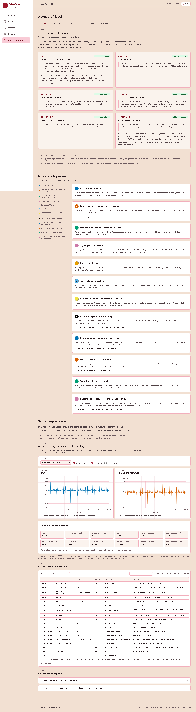

**Figure 1.** The PV-MEPCG / PulseVision framework in one line, the six locked research objectives, the pipeline from recording to screening indication, and the scope-and-safety notice that appears on every route. Route: `/about/`.

## SS-02 — Dataset inventory and class distribution

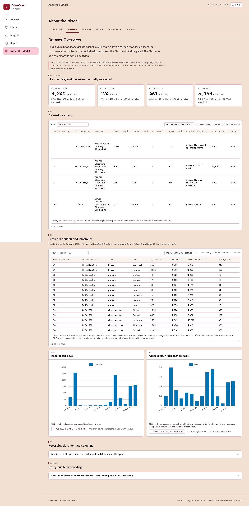

**Figure 2.** The four public PCG corpora as audited against the files on disk (T01): per-dataset inventory, class balance and the duration profile. Every count is read from outputs/01_dataset_audit/, never from the source documents, which disagree with the files in two places. Route: `/about/datasets/`.

## SS-03 — Signal upload and waveform

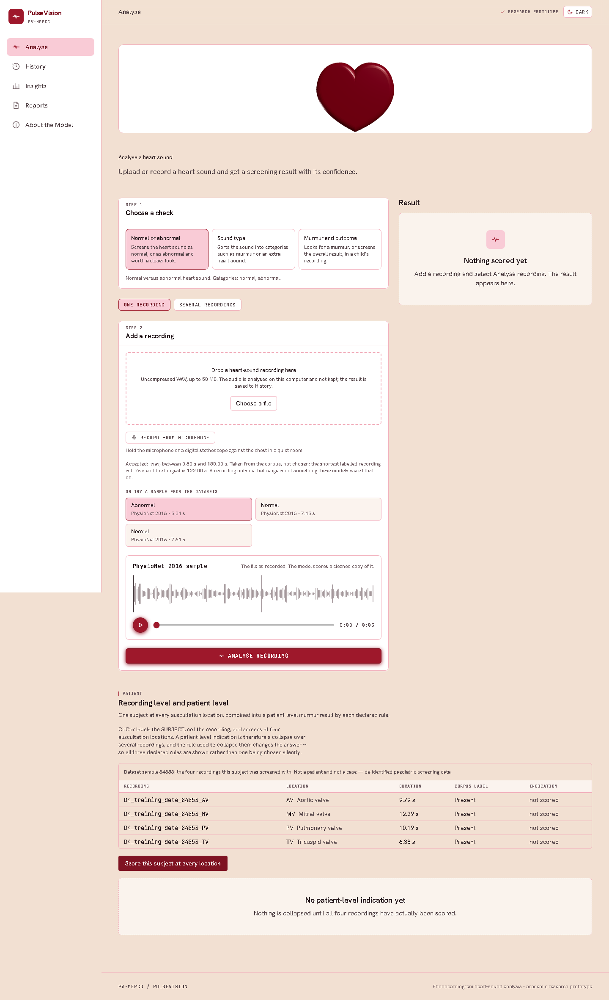

**Figure 3.** Choosing a recording on the binary screening page. A built-in dataset sample has been selected and its waveform drawn from audio served by the local inference service; no corpus audio is committed to the repository. The model has not been run yet -- this is the upload and preview step alone. Route: `/`.

## SS-04 — Preprocessing before/after

**Figure 4.** The preprocessing chain (T02): resampling, band-pass filtering, normalization and signal-quality assessment, with the same recording before and after each stage and the spectral effect of the filter. Route: `/about/`.

## SS-05 — Feature extraction summary

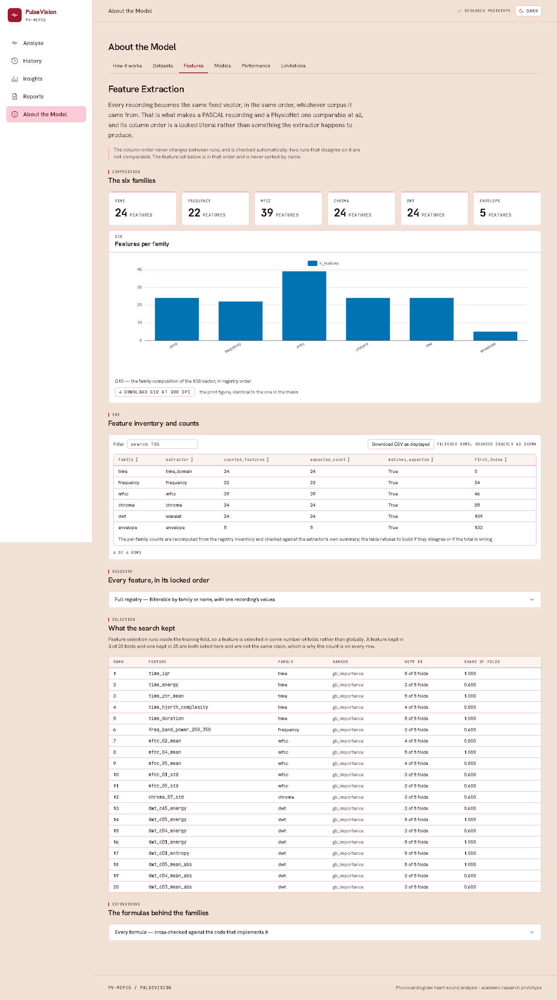

**Figure 5.** The locked 138-feature registry across six families (T03), the fold-safe subset selected inside the training folds, and the family each selected feature belongs to. The column order is a literal in the registry and is fingerprinted, not derived. Route: `/about/features/`.

## SS-06 — Model comparison dashboard

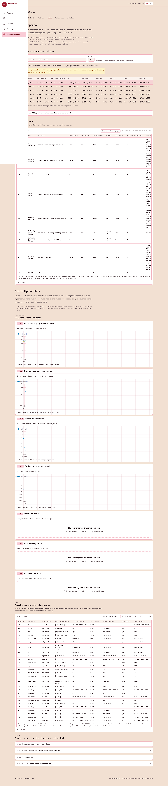

**Figure 6.** The declared models and their fold-wise comparison (T04, T08). Sensitivity, specificity, F1, balanced accuracy and AUC are reported together; accuracy alone never decides anything here. Route: `/about/models/`.

## SS-07 — Search optimization dashboard

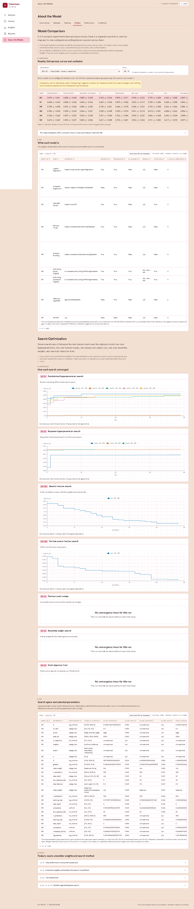

**Figure 7.** The search space, the methods compared at equal budget, the selected parameters and what the search actually bought (T05-T07). Every search shown ran inside a training fold. Route: `/about/models/`.

## SS-08 — Binary prediction output

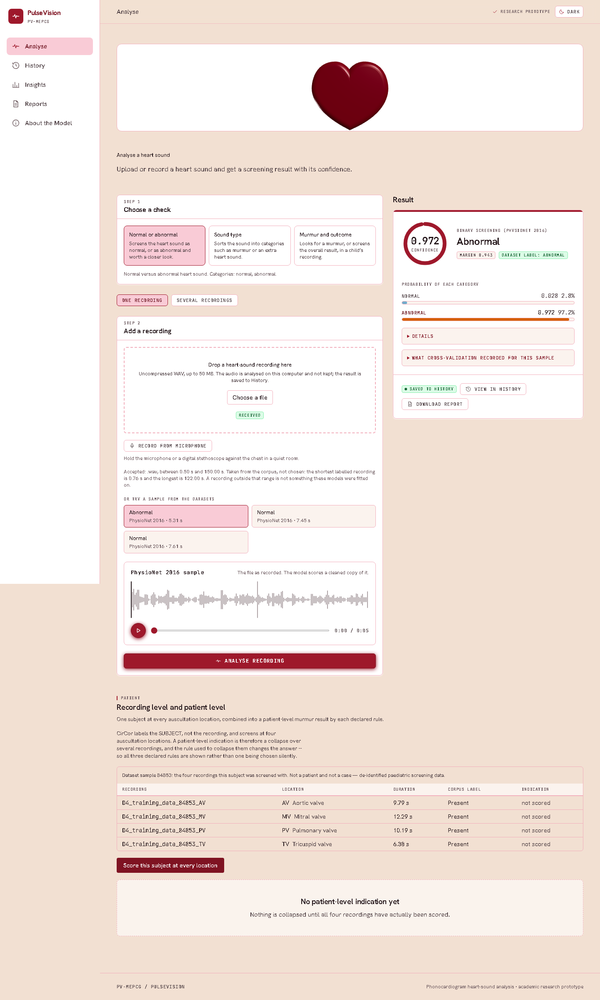

**Figure 8.** A live binary screening indication for one PhysioNet 2016 recording, produced by POST /predict against the deployed model. The panel shows the class probabilities, the confidence margin, the operating threshold and the corpus label, and states that the recording's stored out-of-fold probability is five numbers rather than one. Route: `/`.

## SS-09 — Multiclass prediction output

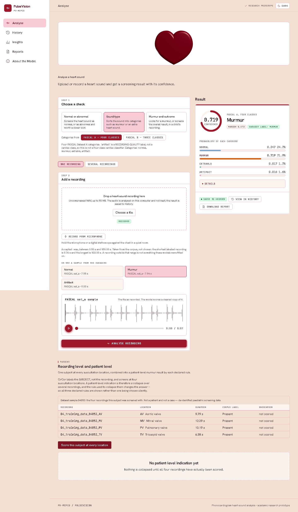

**Figure 9.** A live PASCAL A four-class acoustic-event output with the full probability distribution. PASCAL A and PASCAL B are offered as two separate label spaces on this page and are never merged; `artifact` is a recording-quality label, not a cardiac class. Route: `/`.

## SS-10 — CirCor murmur/outcome output

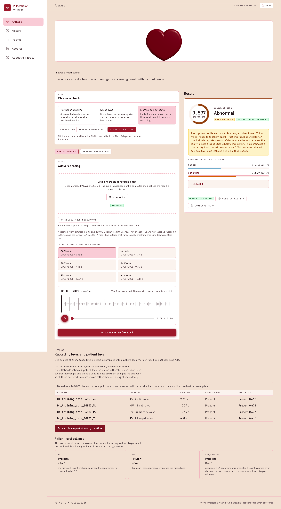

**Figure 10.** The CirCor page with both of its label spaces exercised: a live clinical-outcome indication for one recording above, and below it the same subject collapsed from all four auscultation locations to a patient-level murmur indication under every declared aggregation rule. Murmur and outcome are separate tasks with separate models. Route: `/`.

## SS-11 — Robustness analytics

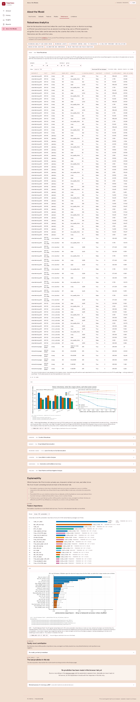

**Figure 11.** How the results move under added noise, shortened recordings, a different corpus and a different auscultation location (T19-T22, T-S5). The leave-one-sub-collection-out result is shown beside the pooled one rather than in place of it. Route: `/about/performance/`.

## SS-12 — Feature importance/explainability

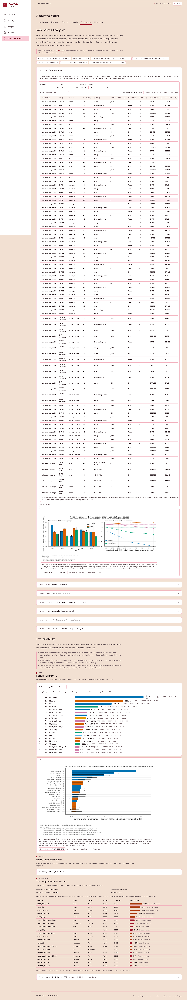

**Figure 12.** Global feature importance and family-level contribution (T23), and the per-sample explanation of the prediction made in this browser tab: the contribution of each feature to that recording's own decision, computed by the API over the exact vector it scored. Route: `/`.

## SS-13 — Exported report preview

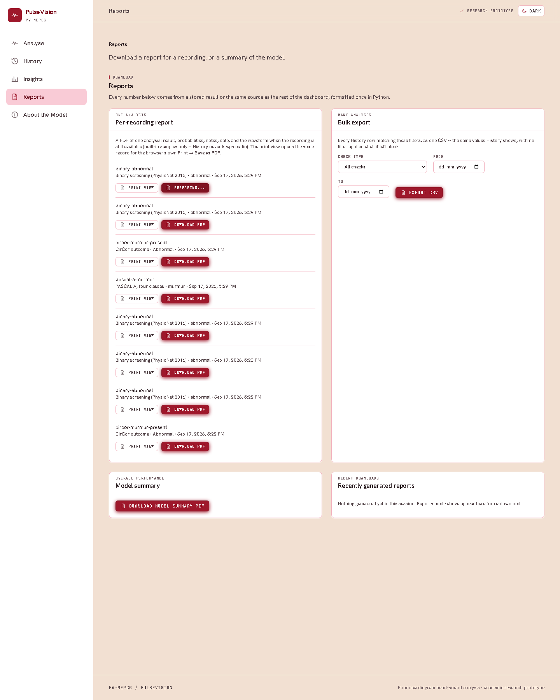

**Figure 13.** The Reports page after a per-recording PDF has really been generated and saved by the running service: the report listed under Recently generated reports, with re-download offered. A PDF cannot be previewed inside the browser, so what is shown is the export in its completed state -- the same PDF T134.7 checks byte-for-byte. Route: `/`.
